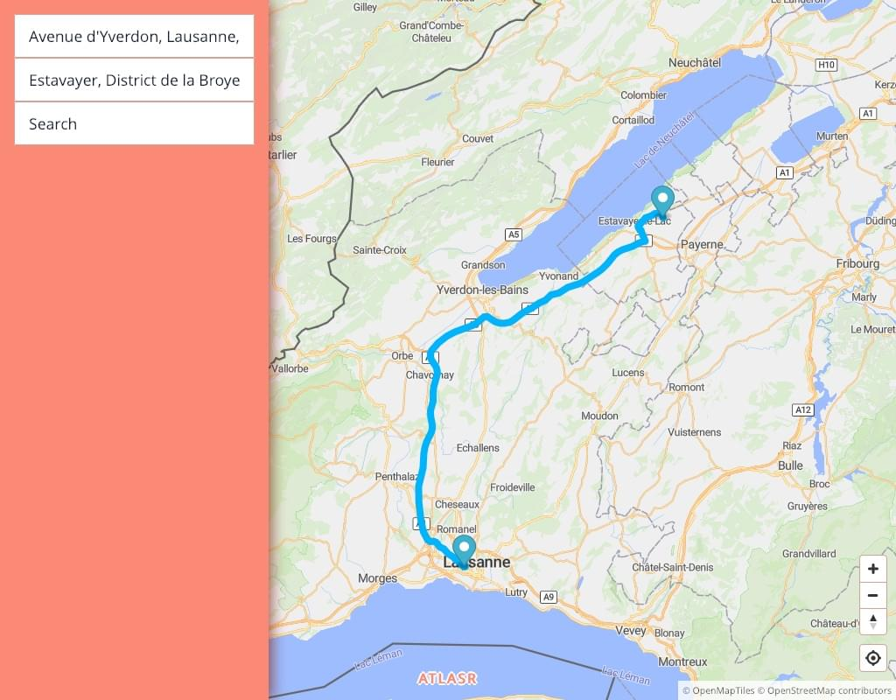

# 🌍 Atlasr

Atlasr is a truly open-source and free map browser. The goal is threefold:

  1. Learn about all the layers and components that make a map,
  2. Provide a ready-to-use set of tools to build a 100% open-source,
     free, and standalone map browser,
  3. Provide an alternative service to the famous [Google Maps][GMaps], with no
     ads, with respect of user privacy, with 100% open-source and
     free data, and the top 10 features of Google Maps.

A map architecture is composed of the following components:

  * **Map data**, A giant database containing all informations about
    roads, trails, cafés, railway stations, buildings etc. The most
    major project is [OpenStreetMap][OSM],
  * **Tile server**, A program that, given a specific region, reads
    the map database and compiles those information in a certain
    format like [`.mbtiles`][MBtiles] for instance. Each region of a
    planet is named a _tile_. A tile is defined by a longitude, a
    latitude, and a zoom (altitude).
  * **Map renderer**, A program that, given a set of tiles,
    renders/draws a map, so each roads, buildings etc. finally come
    alive at this step. A map renderer requires at least the following
    components:
      * **Tile decoder** to decode the tiles received from the tile
        server,
      * **Styles** to know how to draw the data from the map
        (e.g. “road must be blue with a white strike”),
      * **Fonts** to render texts,
      * **Icons** to represent some places with an image (like
        hospitals, police stations, parcs etc.).
  * **Geocoding**, A program that can find the longitude, latitude and
    latitude of a labellised element on earth, like a postal address,
    a building name, or a river name for examples,
  * **Routing**, A program that is able to find a path/route between
    one or many points (longitude + latitude) given some constraints
    (like the vehicule type, the road preference etc.). A route
    preferably comes with descriptions, like “Turn right in 100m”,
    “Follow A10 for 7km” etc.

Obviously, each component comes with thousands of details and
constraints. The previous list is a high overview of how it works.

## Goals

The open-source map ecosystem is mature. Many projects already exist
to address one component of the map architecture. However, a
mainstream tool that combined all these projects, based on 100%
open-source and free data, is still missing. Atlasr aims to be the
response to this problem.

The quality must be comparable with Google Maps:

  * Smooth and fast experience,
  * Reliable data,
  * Beautiful design for the map and the UI.

## Roadmap

The main technologies are the following: [Rust] for the server, [Elm]
for the client, and [PostgreSQL]/[SQLite] for the databases.

The actual roadmap is the following:

  * **Map data**, _all data comes from OpenStreetMap_,
  * **Tile server** [`source/api/tile/`]:
    * [x] Vector tiles are pre-computed by [OpenMapTiles][OMT], which
          relies on OpenStreetMap.
    * [x] Format is `.mbtiles`,
    * [x] Solid and robust tile server.
  * **Map renderer** [`source/map-style`]:
    * [x] Use [Mapbox GL JS] to render the map,
    * [x] Elm ports to Mapbox GL (JavaScript) for the Web UI,
    * [x] Use [OSM Liberty] for the style, forked to remove the
          dependencies to external services, and to use only “local”
          data,
    * [x] Icons/sprites,
    * [ ] Fonts.
  * **Geocoding** [`source/api/geocode`]:
    * [x] Data are pre-computed by [OSM Names][OSMNames], which relies
          on OpenStreetMap,
    * [x] Transform the data to build an index for the search engine,
    * [x] Custom and fast search engine to query the index, build with [Tantivy],
    * [x] Solid and robust server.
  * **Routing** [`source/api/route/`]:
    * [x] Delegate all the works to [GraphHopper], only use the
          open-source API. API to use:
      * [x] Routing API,
      * [ ] Isochrone API.
  * **HTTP server** [`source/server/`]:
    * [x] Fast and robust HTTP server between the client and all the API.
  * **Client**/**Web UI** [`source/client`]:
    * [x] Mobile-first,
    * [x] Smooth and fast,
    * [x] Search one or many positions (geocoding),
    * [x] Search a route (routing),
    * [ ] Search a route with constraints,
    * [ ] Enhance data with Wikipedia (photos, descriptions, metadata etc.),
    * [ ] All links are sharable,
    * More features.
    
**Current focus**: The current hard work is to provide all map
components as local and standalone instances. Everything has been
addressed except the fonts in the map renderer (yet).

**Next focus**: Replace the top 10 features on Google Maps.

### Screenshots

  * **Map renderer**: The tiles, the style, the icons, everything
    comes from Atlasr. No external service is used.

    
    
  * **Geocoding** and **Routing**: Atlasr is able to geoencode 2
    postal addresses, and find a route between the two:
  
    

## Usages

[`just`] is required to run all the commands. Run `just --list` to get an overview of all the commands.

  * **Tile server**:

    ```sh
    $ # Install API tile server.
    $ just install-api-tile

    $ # Run the tile server.
    $ just run-api-tile
    ```
  
  * **Geocoding**:

    ```sh
    $ # Download the data, install the indexer, and install the search engine.
    $ just install-api-geocode

    $ # Run the geocoding server.
    $ just run-api-geocode-searcher
    ```
  
  * **Routing**:
  
    ```sh
    $ # Install the geocoding server.
    $ just install-api-route

    $ # Run the geocoding server.
    $ just run-api-route
    ```
  
  * **Client**/**Web UI**:
  
    ```sh
    $ # Install the HTTP server for the client.
    $ just install-server

    $ # Run the HTTP server for the client.
    $ just run-server

    $ # Install the Web UI, its dependencies, and prepare the frontend.
    $ just install-client

    $ # Open the client.
    $ just open
    ```
  
Enjoy!

## License

The entire project is under the BSD-3-Clause license. Please read the
`LICENSE` file.

[OSM]: https://openstreetmap.org/ 
[MBTiles]: https://github.com/mapbox/mbtiles-spec
[GMaps]: https://google.com/maps
[Rust]: https://rust-lang.org/
[Elm]: https://elm-lang.org/
[PostgreSQL]: https://www.postgresql.org/
[SQLite]: https://www.sqlite.org/
[OMT]: https://openmaptiles.org/
[Mapbox GL JS]: https://www.mapbox.com/mapbox-gl-js/api/
[OSM Liberty]: https://github.com/atlasr-org/osm-liberty/
[OSMNames]: http://osmnames.org/
[Tantivy]: https://github.com/tantivy-search/tantivy/
[GraphHopper]: https://www.graphhopper.com/
[`just`]: https://github.com/casey/just/
